# EDC System Architecture - Class Diagrams

## 1. Authentication & User Management System


## 2. Patient Management System


## 3. Form & Template Management System


## 4. Study Management System


## 5. Audit & Compliance System


## 6. OCR & Data Capture System


## 7. Core Infrastructure Services

```mermaid
classDiagram
    class EventBusService {
        -eventBus$: Subject~AppEvent~
        +emit(event): void
        +on(eventType): Observable~AppEvent~
        +registerHandler(eventType, handler): void
        +unregisterHandler(handlerId): void
    }

    class LanguageService {
        -languages: Language[]
        -currentLanguage: BehaviorSubject~string~
        +setLanguage(lang): void
        +getTranslation(key): string
        +getSupportedLanguages(): Language[]
        +translateForm(form, targetLang): Promise~Form~
    }

    class ExcelConversionService {
        +exportToExcel(data): Promise~Blob~
        +importFromExcel(file): Promise~any[]~
        +validateExcelFormat(file): boolean
        +mapExcelColumns(columns, template): ColumnMapping
    }

    class ToastService {
        -toastSubject: Subject~Toast~
        +toast$: Observable~Toast~
        +success(message): void
        +error(message): void
        +warning(message): void
        +info(message): void
    }

    class AwsConfigService {
        -config: AwsConfig
        +loadConfig(): Promise~void~
        +getRegion(): string
        +getCredentials(): AWSCredentials
        +validateConfig(): boolean
    }
```



## Key Architectural Patterns

### 1. **Service Layer Architecture**
- All business logic encapsulated in services
- Services use dependency injection
- Clear separation of concerns

### 2. **Data Flow**
```
User Interface → Components → Services → Firebase/Cloud Functions → Database
                                ↓
                          Audit Service → Audit Logs
```

### 3. **Security Layers**
- Authentication (EdcCompliantAuthService)
- Authorization (Role-based access)
- Encryption (PhiEncryptionService)
- Audit Trail (CloudAuditService)
- Data Separation (DataSeparationService)

### 4. **Compliance Gaps for CFR 21 Part 11**

#### Missing Components:
1. **Electronic Signature Service** - Needs biometric/cryptographic signatures
2. **Validation Service** - System validation documentation
3. **Change Control Service** - Track all system changes
4. **Training Management** - User training records
5. **System Access Control** - Time-based session management
6. **Data Integrity Service** - Checksums and integrity verification
7. **Backup & Recovery Service** - Automated backups with verification

#### Required Enhancements:
1. **Audit Trail** - Must be computer-generated, time-stamped, and tamper-proof
2. **User Authentication** - Needs two-factor authentication
3. **Electronic Records** - Must maintain complete history with no deletion
4. **System Validation** - Documented testing and validation protocols
5. **Change Management** - Version control for all system components

## Dependencies Graph


This architecture shows a modular system with clear separation of concerns, but lacks several critical components for CFR 21 Part 11 compliance.
