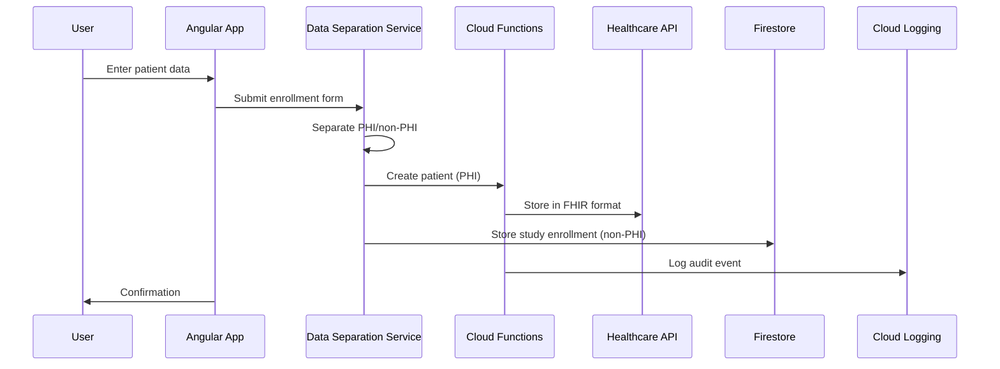
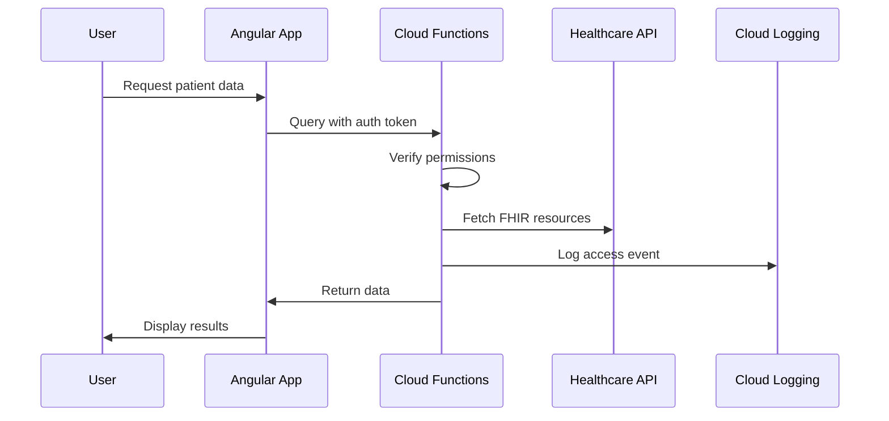

# EDC System Architecture Overview

## System Design Philosophy

This Electronic Data Capture (EDC) system is designed with **compliance-first** principles, ensuring adherence to:
- HIPAA (Health Insurance Portability and Accountability Act)
- 21 CFR Part 11 (FDA Electronic Records)
- GDPR (General Data Protection Regulation)
- India Personal Data Protection Bill

## Core Architecture Principles

### 1. Data Separation Strategy

```
┌─────────────────────────────────────────────────────────────┐
│                     User Interface (Angular)                 │
├─────────────────────────────────────────────────────────────┤
│                  Data Separation Service                     │
├──────────────────────────┬──────────────────────────────────┤
│      PHI Data            │         Non-PHI Data             │
│  (Healthcare API)        │      (Firebase Firestore)        │
├──────────────────────────┼──────────────────────────────────┤
│  • Patient Demographics  │  • Study Metadata                │
│  • Clinical Data         │  • Form Templates                │
│  • Medical Records       │  • User Accounts                 │
│  • Lab Results           │  • System Configuration          │
│  • Consent Forms         │  • De-identified Analytics       │
└──────────────────────────┴──────────────────────────────────┘
```

### 2. Security Layers

```
┌─────────────────────────────────────────────────────────────┐
│                    Authentication Layer                      │
│              (Google Sign-In + Domain Validation)            │
├─────────────────────────────────────────────────────────────┤
│                    Authorization Layer                       │
│              (Role-Based Access Control - RBAC)              │
├─────────────────────────────────────────────────────────────┤
│                      Audit Layer                             │
│           (Immutable Logs in Cloud Logging)                  │
├─────────────────────────────────────────────────────────────┤
│                    Encryption Layer                          │
│              (TLS in Transit, AES-256 at Rest)               │
└─────────────────────────────────────────────────────────────┘
```

## Component Architecture

### Frontend: Angular Application

```typescript
// Key Services
├── AuthService           // Authentication & session management
├── CloudAuditService     // Audit logging
├── HealthcareApiService  // PHI data operations
├── DataSeparationService // PHI/non-PHI routing
└── UserService          // User management
```

### Backend: Cloud Functions

```typescript
// Audit Functions
├── logAuditEvent()      // Write immutable audit logs
├── queryAuditLogs()     // Query with access control
└── exportAuditLogs()    // Scheduled exports

// Healthcare Functions
├── createPatient()      // FHIR patient creation
├── getPatient()         // Retrieve patient data
├── createObservation()  // Clinical data entry
└── createConsent()      // Consent management
```

### Data Storage

```yaml
Google Healthcare API:
  - FHIR Store: Clinical data in HL7 FHIR R4 format
  - Consent Store: Patient consent records
  - DICOM Store: Medical imaging (if needed)

Firebase Firestore:
  - /users: User profiles and roles
  - /studies: Study metadata
  - /formTemplates: CRF templates
  - /auditLogs: Critical audit events
```

## Data Flow Examples

### 1. Patient Enrollment



### 2. Data Query with Audit



## Security Architecture

### Authentication Flow

1. **Google Sign-In** → Firebase Auth
2. **Domain Validation** → Organizational accounts only
3. **User Profile Check** → Status must be ACTIVE
4. **Session Management** → 30-minute timeout
5. **Audit Logging** → Every auth event logged

### Authorization Matrix

| Role | Studies | Users | PHI Data | Audit Logs | System Config |
|------|---------|-------|----------|------------|---------------|
| SUPER_ADMIN | Full | Full | Full | Full | Full |
| ADMIN | Create/Edit | Manage | Read/Write | Read | Read |
| INVESTIGATOR | Create/Edit | - | Read/Write | - | - |
| MONITOR | Read | - | Read | Read | - |
| DATA_ENTRY | Edit | - | Write | - | - |
| VIEWER | Read | - | - | - | - |

### Audit Trail Architecture

```
┌─────────────────────────────────────────────────────────────┐
│                     User Action                              │
├─────────────────────────────────────────────────────────────┤
│                  Angular Service                             │
├─────────────────────────────────────────────────────────────┤
│                  Cloud Function                              │
├──────────────────────────┬──────────────────────────────────┤
│   Cloud Logging          │      Firestore                   │
│   (Immutable)            │   (Critical Events)              │
├──────────────────────────┼──────────────────────────────────┤
│ • Complete audit trail   │ • Quick access                   │
│ • Server timestamps      │ • Real-time queries              │
│ • Tamper-proof           │ • Dashboard display              │
│ • 7-year retention       │ • Recent events                  │
└──────────────────────────┴──────────────────────────────────┘
```

## Compliance Features

### 21 CFR Part 11 Compliance

1. **Electronic Signatures**
   - User authentication before each critical action
   - Timestamp and user ID captured server-side
   - Signature meaning recorded

2. **Audit Trails**
   - Computer-generated, time-stamped
   - Capture create, modify, delete actions
   - User ID, timestamp, old/new values
   - Immutable and secure

3. **Access Controls**
   - Unique user identification
   - Role-based permissions
   - Automatic session timeout

### HIPAA Compliance

1. **Technical Safeguards**
   - Encryption at rest and in transit
   - Access control and audit logs
   - Automatic logoff

2. **Administrative Safeguards**
   - User access management
   - Training tracking
   - Security incident procedures

3. **Physical Safeguards**
   - Google Cloud infrastructure
   - Geographic data residency
   - Disaster recovery

## Scalability & Performance

### Horizontal Scaling

- **Cloud Functions**: Auto-scale based on load
- **Healthcare API**: Google-managed scaling
- **Firestore**: Automatic sharding
- **Angular**: CDN distribution

### Performance Optimization

1. **Caching Strategy**
   - Client-side: Angular service workers
   - API responses: HTTP cache headers
   - Static assets: Firebase Hosting CDN

2. **Query Optimization**
   - Firestore: Composite indexes
   - Healthcare API: Batch operations
   - Pagination: Limit result sets

## Disaster Recovery

### Backup Strategy

```
Daily Backups:
├── Healthcare API → Cloud Storage
├── Firestore → Automated exports
├── Audit Logs → Long-term archive
└── Code → Git repository
```

### Recovery Time Objectives

- **RTO (Recovery Time)**: < 4 hours
- **RPO (Recovery Point)**: < 24 hours
- **Audit Trail**: No data loss (immutable)

## Monitoring & Alerting

### Key Metrics

1. **System Health**
   - API response times
   - Error rates
   - Function execution time

2. **Security Events**
   - Failed login attempts
   - Unauthorized access
   - Data export events

3. **Compliance Metrics**
   - Audit log completeness
   - User training status
   - Consent expiration

### Alert Channels

- Email notifications
- Cloud Console mobile app
- PagerDuty integration (optional)
- Slack webhooks (optional)

## Future Enhancements

### Phase 2 Features

1. **Multi-Factor Authentication**
   - SMS/App-based 2FA
   - Hardware token support

2. **Advanced Analytics**
   - Real-time dashboards
   - Predictive analytics
   - ML-based anomaly detection

3. **Integration Capabilities**
   - EDC system APIs
   - HL7 FHIR interfaces
   - Clinical trial management systems

### Phase 3 Features

1. **Mobile Applications**
   - iOS/Android apps
   - Offline data capture
   - Biometric authentication

2. **AI/ML Features**
   - Auto-coding of adverse events
   - Data quality predictions
   - Smart form validation

## Technology Stack Summary

### Frontend
- Angular 19 (Standalone Components)
- TypeScript 5.x
- RxJS 7.x
- Angular Material
- TailwindCSS

### Backend
- Firebase Cloud Functions
- Node.js 18+
- TypeScript
- Express.js (internal)

### Data Storage
- Google Healthcare API (FHIR R4)
- Firebase Firestore
- Cloud Storage (backups)

### Infrastructure
- Firebase Hosting
- Google Cloud Platform
- Cloud Logging
- Cloud Scheduler

### Security
- Firebase Authentication
- Google Identity Platform
- Cloud IAM
- VPC Service Controls

This architecture ensures a robust, compliant, and scalable EDC system suitable for clinical trials and healthcare data management.
